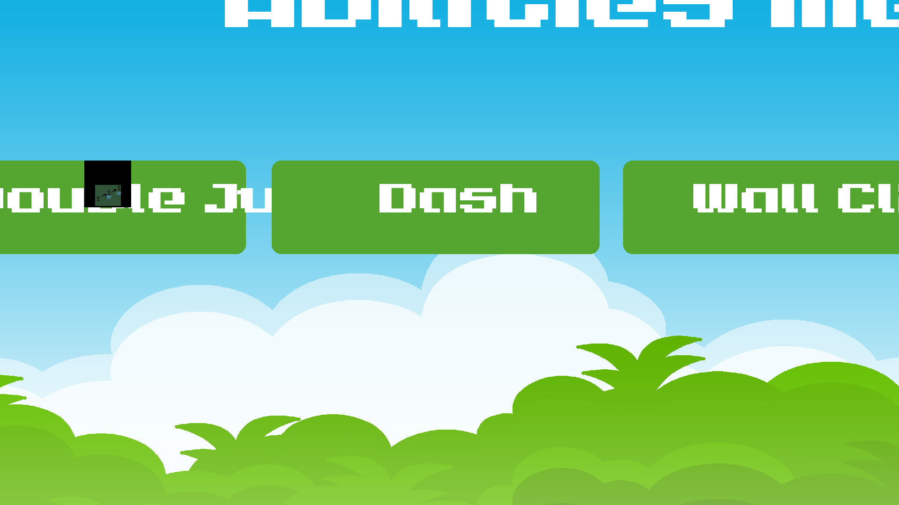

# That Time I Got Stuck In Another World With No Way Back Home And Had To Use Magical Movement Abilities To Get Warped Back!
***

***
It's a platformer where a kid from our world is pulled into the world of another. He has to use special abilites to navigate the harsh terrain and escape hazards. After completing each of the three levels, he'll warp back to our world. After each level, he earns one more special ability. Dash, Double Jump, and Wall Climb are the special abilities he'll earn throught the game.

## Steps for Use
1. Run project through main
2. Select save file you would like to use
3. Select ability you would like to use
4. Select character you would like to use
5. Play the game!

## List of KEY features
- Custom made Save Menu, Ability Menu, and Character Menu 🏠
- Save slots ⬇️
- Character customization 🧑
- Ability selection 🧙
- Three different levels. ⛰️
    - Level 1 is in a grassy area 🌳
    - Level 2 is a cave 🗻
    - Level 3 is a fiery zone 🔥
- ⚠️ Hazards are placed throughout the maps ⚠️
    - Spikes 🔺
    - Lava & Fire 🔥
    - Fiery Bird 🐦‍🔥
- Sprites are used for entities to have skins and custom apperances 😊

## Installation Instructions
1. 'pip install pygame' in terminal
2. 'pip install pandas' in terminal

## Contributors
- franco-barboza27 
- arshsc
- HunterWildClaw

## Licence information
- UCAS School 

## Contributions
- Feel free to add more levels and mods (story mode, custom skins, etc) and share them to the community.
